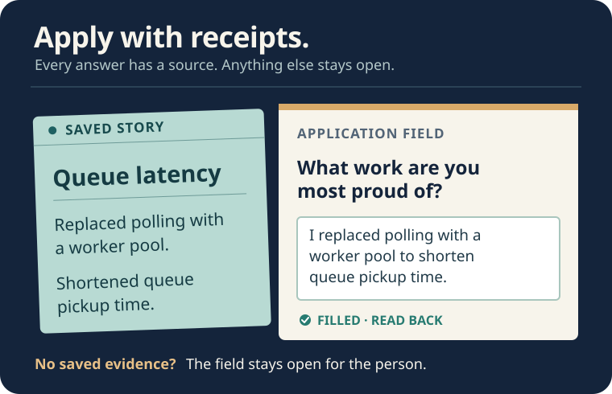
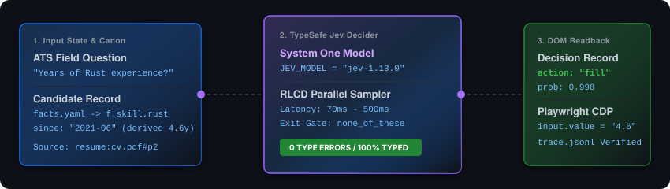
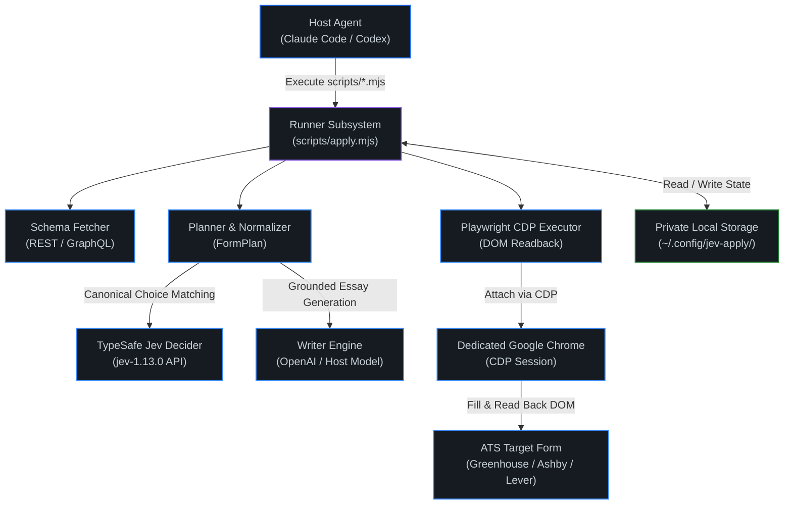
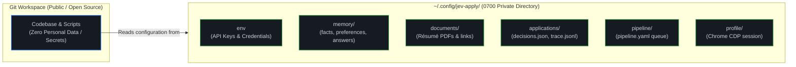
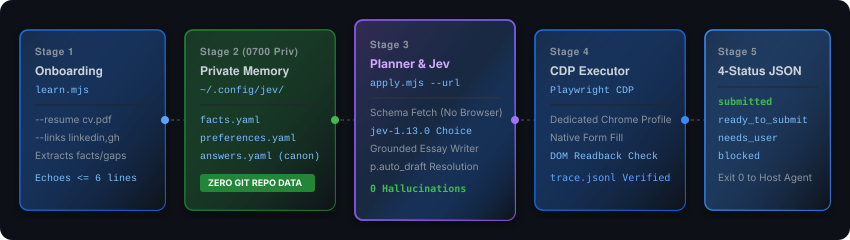

<div align="center">

# jev-apply

**A job-application skill with a memory.** Give it a résumé and a posting. It fills what your record supports, drafts grounded prose when you allow it, and leaves the rest open rather than guessing.

<p align="center">
  <a href="https://github.com/theadaply/jev-apply/stargazers"></a>
  <a href="https://github.com/theadaply/jev-apply/network/members"></a>
  <a href="https://github.com/theadaply/jev-apply/issues"></a>
  <a href="LICENSE"></a>
  <a href="https://nodejs.org"></a>
  <a href="https://google.com/chrome"></a>
  <a href="https://typesafe.ai"></a>
  <a href="https://console.typesafe.ai/keys"></a>
  <a href="AGENTS.md"></a>
</p>

<br/>



</div>

---

## Give it to your CLI agent

In Codex, Claude Code, or another agent that can run shell commands, paste this:

```text
Set up TheAdaply/jev-apply.
Read SKILL.md and INSTALL.md.
Install and configure it.
Show me where to enter my Jev
key privately, not in chat.
Learn my résumé. Fill a URL
I give you, with --no-submit
on every run and rerun.
Use this CLI model for drafts
grounded in my record unless
I set a writer.
Show me the filled form. Ask
only for missing facts,
choices or attestations.
```

The agent follows [SKILL.md](SKILL.md) for the workflow and [INSTALL.md](INSTALL.md) for setup. You need **Node 20+, Google Chrome, and a [TypeSafe Jev key](https://console.typesafe.ai/keys)**. OpenAI is optional; the agent can draft from the model already running in your CLI. No personal data belongs in this repo.

---

## TypeSafe AI Jev System One Motion Engine



`jev-apply` uses [TypeSafe AI's Jev model (`jev-1.13.0`)](https://typesafe.ai/blog/introducing-system-one-models-and-jev)—a System One AI model optimized for **parallel sampling**, **zero type errors**, and **70ms–500ms calibrated decision latency**. Unstructured candidate state enters the decider, and structured probabilistic decisions return without hallucination risk.

---

## Tech Stack & Ecosystem

### Languages & Runtimes
<p>
  <a href="https://nodejs.org"></a>
  <a href="https://developer.mozilla.org/en-US/docs/Web/JavaScript"></a>
  <a href="https://yaml.org"></a>
  <a href="https://graphql.org"></a>
</p>

### AI Infrastructure & Decision Engine
<p>
  <a href="https://typesafe.ai"></a>
  <a href="https://typesafe.ai/blog/introducing-system-one-models-and-jev"></a>
  <a href="https://openai.com"></a>
  <a href="AGENTS.md"></a>
</p>

### Automation, Testing & DevTools
<p>
  <a href="https://playwright.dev"></a>
  <a href="https://google.com/chrome"></a>
  <a href="https://git-scm.com"></a>
  <a href="https://github.com/features/actions"></a>
  <a href="https://npmjs.com"></a>
</p>

---

## Architecture & Technical System Design

### System Component Architecture



---

## Data Isolation & Privacy Storage Architecture

No candidate data, personal history, or credentials belong in this repository. All sensitive state is stored strictly under `~/.config/jev-apply/` with `0700` permissions.



---

## What happens to each field

**Jev matches** the form question to a saved fact, preference, story, or answer. **A writer drafts** only new prose supported by your material and the posting, when `p.auto_draft` is on: OpenAI, a named OpenAI-compatible model at a configured endpoint, or your CLI agent. **Playwright fills and reads back** every supported control.

Unknown personal facts, EEO choices, and policy attestations are **not model questions**. Your agent asks you when the exact answer is not on file. Drafts stay with that application unless you explicitly save them. Automatic submission is a separate opt-in; Lever always leaves Submit to you.

> [!NOTE]
> Experimental. Hosted Greenhouse, Ashby and Lever forms are supported; LinkedIn Easy Apply is not. Jev makes API calls, so this is not an offline tool.

### Platform Support Summary

| ATS Platform | Support Status | Schema Fetch | Submission Mode | Notes |
| :--- | :---: | :--- | :--- | :--- |
| **Greenhouse** |  | REST API / DOM | Auto / Manual (`p.auto_submit`) | Direct field resolution |
| **Ashby** |  | GraphQL API | Auto / Manual (`p.auto_submit`) | Native component support |
| **Lever** |  | DOM Parsing | Manual Only | Always stops before hCaptcha challenge |
| **LinkedIn Easy Apply** |  | N/A | N/A | Excluded per LinkedIn ToS §8.2 |

---

## The Four-Status Return Contract

`scripts/apply.mjs` outputs exactly one JSON object on `stdout` and exits `0` across all four operational outcomes:

| Status | Trigger Condition | Output Payload Summary |
| :--- | :--- | :--- |
|  | Form filled, `p.auto_submit` resolved true, and ATS confirmation detected. | `{ slug, confirmation: { detected, text, url, screenshot }, filled, usage }` |
|  | All fields resolved, `p.auto_submit` off/unset or ATS is Lever. | `{ slug, filled, summary: "ready for user review", usage }` |
|  | Unresolved facts, attestations, or agent draft items remaining. | `{ questions: [ { qid, label, options, remember_as, why } ] }` |
|  | Unsupported ATS, captcha boundary, or unconfirmed submit. | `{ reason, detail, screenshot }` |

---

## CLI Command Reference (5 Core Verbs)



| Verb | Command | Function & Behavior |
| :--- | :--- | :--- |
| **1. Learn** | `node scripts/learn.mjs --resume cv.pdf --links <urls>` | Onboards background, extracts facts/stories, and outputs onboarding gaps. |
| **2. Apply** | `node scripts/apply.mjs --url <posting-url> --no-submit` | Fetches schema, plans decisions with Jev, drafts prose, and fills form via CDP. |
| **3. Remember** | `node scripts/remember.mjs "<verbatim-user-instruction>"` | Classifies and persists standing preferences or corrections into memory. |
| **4. Scan** | `node scripts/scan.mjs` / `node scripts/pipeline.mjs list` | Scans tracked company job boards, scores candidate fit, and updates pipeline. |
| **5. Queue** | `node scripts/apply.mjs --queue 5` | Plans N applications in parallel, fills tabs, and returns deduplicated questions. |

---

## Evidence and boundaries

The [form evaluation and per-page results](bench/results/fresh-pages.md) describe a measured set, not a universal success rate. The runner reads back filled controls, keeps the browser tab open for review, and records `submitted` only after the ATS confirms it. Start with `--no-submit` until you have inspected a real form yourself.

---

## Build and inspect

`npm run check:syntax` checks parsing, not application behavior. The [CI workflow](.github/workflows/ci.yml) runs it after `npm ci`; `node eval/plan.test.mjs` uses private memory and makes live, paid Jev calls. Browser fixture checks live in `scripts/controls-smoke.mjs` and `scripts/submit-smoke.mjs`. Read [AGENTS.md](AGENTS.md) for contributor rules and [docs/PLAN.md](docs/PLAN.md) for decisions.

---

## License

[MIT](LICENSE) © 2026 TheAdaply.


