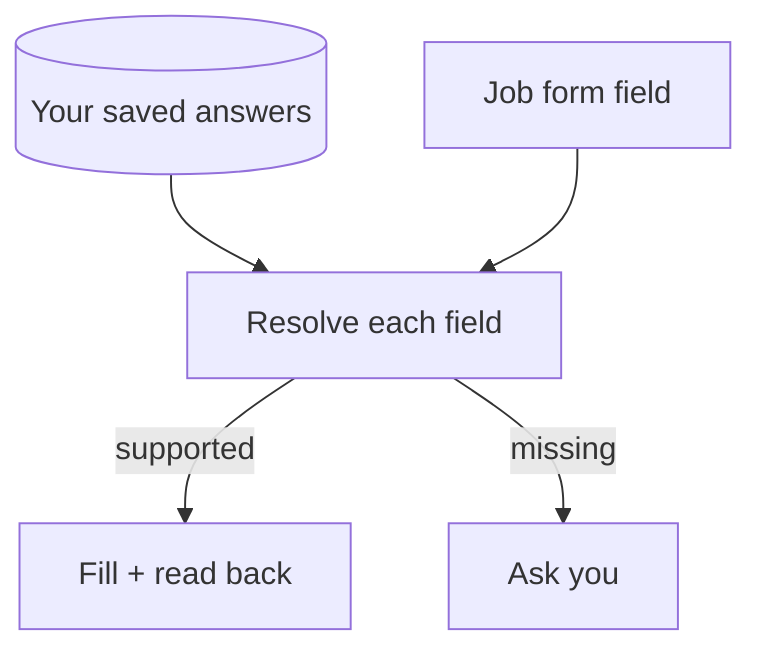

# jev-apply

Fill job applications from your saved answers, without inventing personal details.

jev-apply remembers what you tell it, matches saved answers to hosted job forms with Jev, and uses Playwright to fill and read back each field. If a personal detail is missing, it asks you.

> [!NOTE]
> Experimental. Supports hosted Greenhouse, Ashby and Lever forms. Lever always leaves the final Submit click to you; LinkedIn Easy Apply is not supported.

## How it works



Jev chooses which saved answer fits. A writer (OpenAI, a local model, or your host agent) can draft new prose if you opt in; drafts do not become saved facts unless you keep them. Files live under `~/.config/jev-apply/`, outside this repo. Jev makes API calls, so this is not an offline tool.

## Get started

You need Node 20+, Google Chrome and a [TypeSafe Jev key](https://console.typesafe.ai/keys). OpenAI is optional.

```bash
git clone https://github.com/TheAdaply/jev-apply.git
cd jev-apply
npm ci
node scripts/install.mjs
umask 077
touch ~/.config/jev-apply/env
chmod 600 ~/.config/jev-apply/env
${EDITOR:-vi} ~/.config/jev-apply/env
node scripts/install.mjs
```

In the editor, add `TYPESAFE_API_KEY=your-key`. Keep the real key out of the repo and your shell history. The second install checks for a nonempty value, not whether the key works; see [installation and writer options](INSTALL.md).

## Your first application

### 1. Learn your background

```bash
node scripts/learn.mjs --resume /path/to/resume.pdf
```

If it returns `needs_user`, put your responses in `~/.config/jev-apply/onboarding-answers.json`. Use each question's `remember_as.id` as the JSON key: `g.email`, for example, is answered under `f.identity.email`, not `g.email`. A gap without `remember_as` names the fact IDs to use. Then run:

```bash
node scripts/learn.mjs --answers ~/.config/jev-apply/onboarding-answers.json
```

### 2. Fill the form

Replace the example URL with a hosted posting you choose:

```bash
JOB_URL='https://job-boards.greenhouse.io/<board>/jobs/<id>'
node scripts/apply.mjs --url "$JOB_URL" --no-submit
```

### 3. Answer what is missing

If you get `needs_user`, write `{"<qid>":{"value":"your answer"}}` to `~/.config/jev-apply/application-answers.json`, using the printed `qid`. Then run:

```bash
node scripts/apply.mjs --url "$JOB_URL" --answers ~/.config/jev-apply/application-answers.json --no-submit
```

`--no-submit` is per run: keep it on every answer or queue rerun. `ready_to_submit` leaves the tab open for review; `node scripts/apply.mjs --resume <slug>` lists any unfilled fields. `blocked` gives a reason and keeps any opened tab available. A run only reports `submitted` after the ATS confirms a click, and auto-submit is opt-in.

## Measured on real forms

```text
Final rerun: 12 pages, 229 fields
Correct  178  ██████████████████
Open      50  █████
Missed     1  ▏
Wrong      0
```

Each full block represents about 10 fields; the counts are exact. The 12 Greenhouse/Ashby
pages were new before the **first** pass. These numbers come from a **third pass over the
same pages**, after fixes, with every field graded from screenshots by an independent
reviewer. "Open" means no answer was on file, a policy gate refused to sign, or the control
could not be filled. No application was submitted. This is one evaluated set, not a
promise for other forms. [Method and per-page results](bench/results/fresh-pages.md).

## More than one form

```bash
node scripts/remember.mjs "never apply to contract roles"
node scripts/scan.mjs
node scripts/pipeline.mjs list
node scripts/pipeline.mjs queue 12 15  # replace with IDs from your list
node scripts/apply.mjs --queue 2 --no-submit
```

Queue mode groups repeated questions into one batch. Add `--answers ~/.config/jev-apply/application-answers.json` on a rerun, keeping `--no-submit`. Or [install the agent skill](SKILL.md) with `npx skills add theadaply/jev-apply` and say "learn my background" or "complete this application".

## For contributors

- `npm run check:syntax` checks parsing only; the credential-free [CI workflow](.github/workflows/ci.yml) runs it after `npm ci`.
- `node eval/plan.test.mjs` makes live, paid Jev calls against recorded form schemas and private memory. Browser fixtures: `scripts/controls-smoke.mjs` and `scripts/submit-smoke.mjs`.
- [Agent instructions](AGENTS.md) · [Design decisions](docs/PLAN.md) · [Module contracts](docs/CONTRACTS.md) · [Issues](https://github.com/TheAdaply/jev-apply/issues). Never run `eeo-smoke.mjs` on a real posting for a demo.

## License

[MIT](LICENSE) © 2026 TheAdaply.
