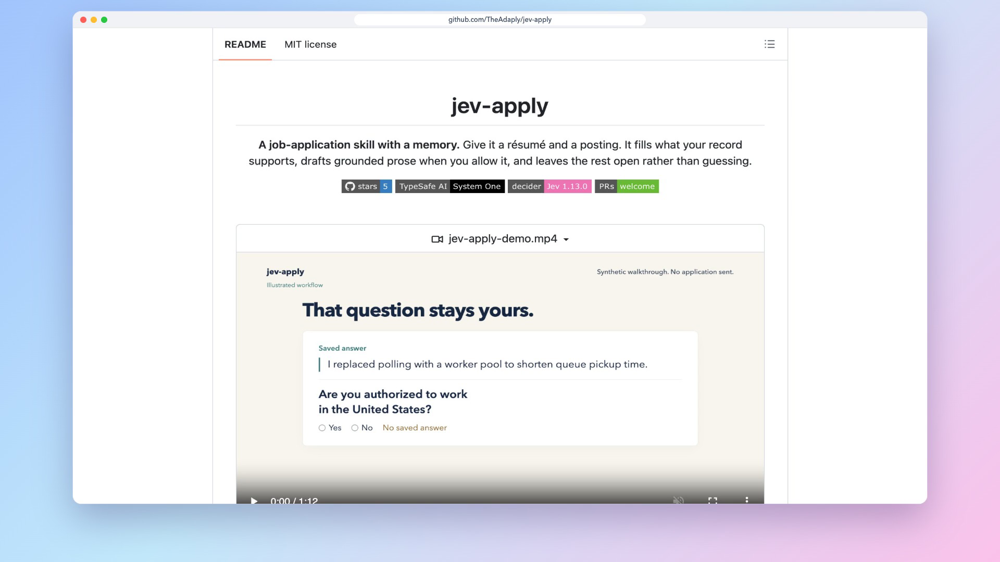

<div align="center">

# jev-apply

**A job-application skill with a memory.** Give it a résumé and a posting. It fills what your record supports, drafts grounded prose when you allow it, and leaves the rest open rather than guessing.

<p align="center">
  <a href="https://github.com/theadaply/jev-apply/stargazers"></a>
  <a href="https://typesafe.ai"></a>
  <a href="https://console.typesafe.ai/keys"></a>
  <a href="AGENTS.md"></a>
</p>

<br/>

[](https://github.com/user-attachments/assets/31ee821d-52bb-4f8f-a5fe-36df69b47fb2)

*16 seconds · a real run · two applications filled and submitted · fills shown at 2×*

</div>

---

## Give it to your CLI agent

In Codex, Claude Code, or another CLI agent:

```text
Set up TheAdaply/jev-apply. Read SKILL.md and INSTALL.md.
Install and configure it. Show me where to enter my Jev key privately,
not in chat. Learn my résumé. Fill a URL I give you, with --no-submit
on every run and rerun. Use this CLI model for drafts grounded in my
record unless I set a writer. Show me the filled form. Ask only for
missing facts, choices or attestations.
```

The agent handles setup. You provide a [TypeSafe Jev key](https://console.typesafe.ai/keys)
privately—not in chat. Requires Node 20+ and Chrome; OpenAI is optional.

Experimental: hosted Greenhouse, Ashby, and Lever forms. No LinkedIn Easy Apply.
Personal facts, demographic choices, and policy attestations come from you.
Private memory stays on disk; model APIs receive request data and may incur costs.

[Agent guide](SKILL.md) · [Setup](INSTALL.md) · [Engineering](AGENTS.md) · [Measured results](bench/results/fresh-pages.md) · [MIT](LICENSE)
