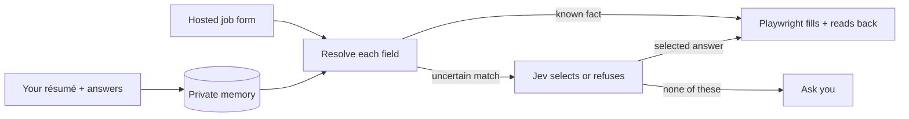
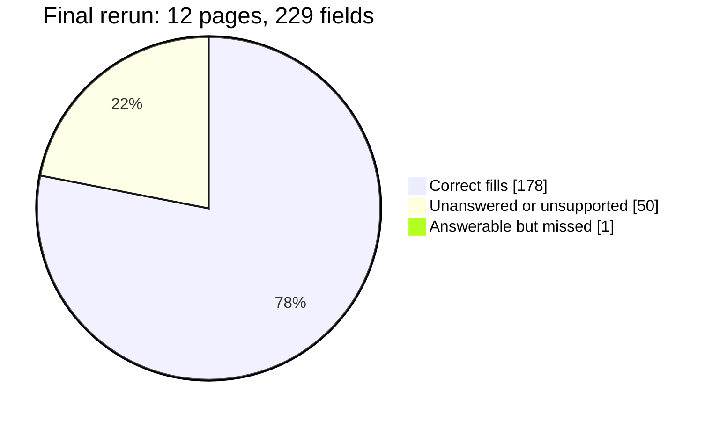

# jev-apply

Fill job applications from your saved answers, without inventing personal details.

jev-apply reuses your résumé and answers across hosted Greenhouse, Ashby and Lever forms. Jev matches saved answers, Playwright fills and reads them back, and unknown facts come back to you.

**Status:** experimental; hosted forms only. Lever leaves the final Submit click to you. LinkedIn Easy Apply is not supported.

## How it works



New writing is optional: OpenAI, a local model, or your host agent can draft a paragraph. A draft is checked against your material and is not saved as a fact unless you keep it.

## Get started

You need Node 20+, Google Chrome, and a [TypeSafe Jev key](https://console.typesafe.ai/keys). OpenAI is optional. The installer creates `~/.config/jev-apply/`; put your real key only in its private `env` file, not in this repo or a shell command.

```bash
git clone https://github.com/TheAdaply/jev-apply.git
cd jev-apply
npm ci
node scripts/install.mjs
umask 077; touch ~/.config/jev-apply/env; chmod 600 ~/.config/jev-apply/env
${EDITOR:-vi} ~/.config/jev-apply/env
node scripts/install.mjs
```

In the editor add `TYPESAFE_API_KEY=your-key`. The second install checks that the value is nonempty, not that the key is valid. [Writer and agent setup](INSTALL.md) has the optional choices.

## Use it

1. Import your résumé: `node scripts/learn.mjs --resume /path/to/resume.pdf`.
2. Answer the returned `gaps` in `~/.config/jev-apply/onboarding-answers.json`, keyed by `remember_as.id`. For example, `g.email` asks for `f.identity.email`, **not** `g.email`; gaps without `remember_as` name their fact IDs in the question. Save only your own answers.
3. Store them: `node scripts/learn.mjs --answers ~/.config/jev-apply/onboarding-answers.json`.

Then fill a hosted posting. Replace the URL with the one you are applying to:

```bash
JOB_URL='https://job-boards.greenhouse.io/<board>/jobs/<id>'
node scripts/apply.mjs --url "$JOB_URL" --no-submit
```

If the result is `needs_user`, save `{"<qid>":{"value":"your answer"}}` to `~/.config/jev-apply/application-answers.json` using the printed `qid`, then run:

```bash
node scripts/apply.mjs --url "$JOB_URL" --answers ~/.config/jev-apply/application-answers.json --no-submit
```

Keep `--no-submit` on every demo run, including answer reruns. `ready_to_submit` leaves the filled tab open for review; `node scripts/apply.mjs --resume <slug>` lists anything still missing. `submitted` means the ATS confirmed a click; `blocked` gives a reason and keeps any opened tab available for manual completion. Auto-submit is opt-in, and Lever always requires your click.

## Evidence from real forms



The 12 Greenhouse/Ashby pages were new before the first of **three passes**. After fixes informed by earlier passes, an independent screenshot review of the final rerun found **178 correct fills, 0 wrong fills, 50 unanswered or unsupported fields, and 1 missed field**. No application was submitted. This is one evaluated set, not a guarantee on other forms. [Method and per-page results](bench/results/fresh-pages.md).

## Other ways to use it

```bash
node scripts/remember.mjs "never apply to contract roles"
node scripts/scan.mjs
node scripts/pipeline.mjs list
node scripts/pipeline.mjs queue 12 15  # use IDs from your list
node scripts/apply.mjs --queue 2 --no-submit
```

The queue batches repeated questions. On a `needs_user` rerun, add `--answers ~/.config/jev-apply/application-answers.json` **and keep `--no-submit`**. Or install the [agent skill](SKILL.md) with `npx skills add theadaply/jev-apply` and ask it to learn your background, find roles, or complete an application.

## Contributing

`npm run check:syntax` parses tracked JavaScript and is the credential-free CI gate; it does not test behavior. `node eval/plan.test.mjs` uses private memory and live paid Jev calls. Browser fixture checks live in `scripts/controls-smoke.mjs` and `scripts/submit-smoke.mjs`; never run `eeo-smoke.mjs` on a real posting for a demo. Read [agent instructions](AGENTS.md), [design decisions](docs/PLAN.md), and [module contracts](docs/CONTRACTS.md) before editing. [Issues and PRs](https://github.com/TheAdaply/jev-apply/issues) welcome.

## License

[MIT](LICENSE) © 2026 TheAdaply.
