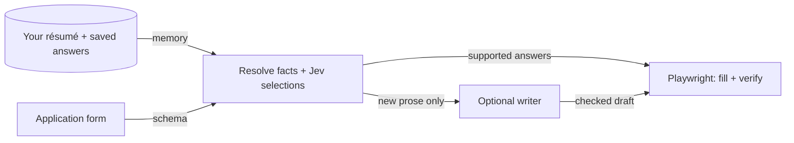
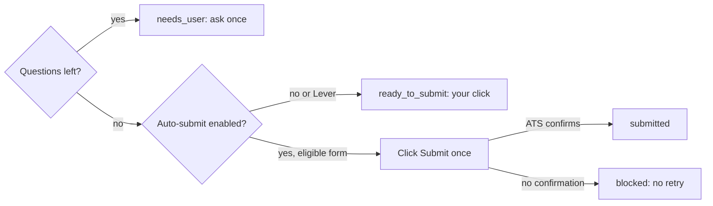
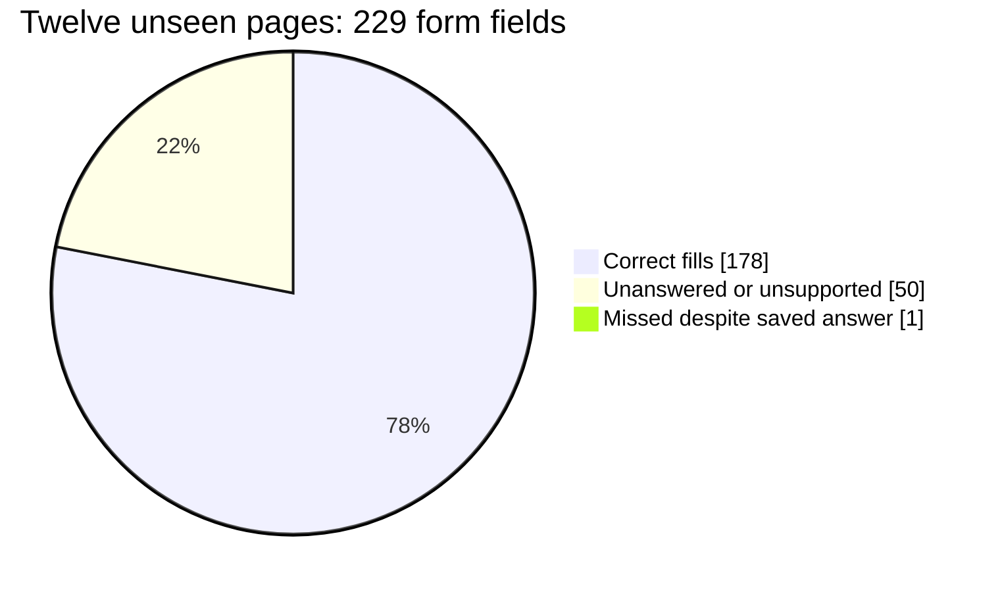

# jev-apply

Memory-backed job applications: Jev selects saved answers, an optional writer drafts, Playwright verifies.

Save your résumé and answers once. jev-apply fills hosted **Greenhouse**, **Ashby**, and **Lever** forms from your own material, asks when a fact is missing, and reads every write back. Your data lives in `~/.config/jev-apply/`, not this repo. **Status:** experimental; ATS forms can change. Lever always leaves the final Submit click to you.

## How it works



Jev **selects**, never writes. Drafts come from OpenAI, a local model, or your host agent, and never become saved facts unless you explicitly keep them.



No guessed personal or demographic facts; no first-option fallback; attestations require your explicit stance. A failed or unconfirmed submission keeps the tab open.

## Measured, not promised



On 12 previously unseen Greenhouse/Ashby pages, an independent screenshot review found **0 wrong fills**; 50 rows lacked a saved answer, needed your consent, or could not be filled, and one answerable row was missed. No applications were submitted. [Method and per-page results](bench/results/fresh-pages.md).

## Install

Requires **Node 20+**, **Google Chrome**, and a [TypeSafe Jev key](https://console.typesafe.ai/keys). No OpenAI key is required.

```bash
git clone https://github.com/theadaply/jev-apply.git
cd jev-apply
npm ci
node scripts/install.mjs
umask 077; touch ~/.config/jev-apply/env; chmod 600 ~/.config/jev-apply/env
${EDITOR:-vi} ~/.config/jev-apply/env
node scripts/install.mjs
```

In the editor, add `TYPESAFE_API_KEY=your-key` to the private `env` file. To draft new prose automatically, also set `OPENAI_API_KEY` **or** `JEV_APPLY_WRITER_URL` and `JEV_APPLY_WRITER_MODEL`; otherwise your host agent can write it. See [installation options](INSTALL.md).

## Use it

```bash
node scripts/learn.mjs --resume /path/to/resume.pdf
node scripts/apply.mjs --url "https://job-boards.greenhouse.io/company/jobs/123" --no-submit
```

Replace the résumé path and posting URL with yours.

- **Onboarding:** `learn.mjs` returns `gaps`. Save `{"<id>": <answer>}` to `~/.config/jev-apply/answers.json`, then run `node scripts/learn.mjs --answers ~/.config/jev-apply/answers.json`.
- **Missing answers:** an application returns `needs_user` with question IDs. Save `{"<qid>":{"value":"your answer"}}` to that private answer file, then rerun `apply.mjs` with the same URL and `--answers ~/.config/jev-apply/answers.json`.
- **Review:** `ready_to_submit` leaves the tab open; `node scripts/apply.mjs --resume <slug>` reattaches. Auto-submit is opt-in; `--no-submit` forces review. `submitted` requires ATS confirmation; `blocked` includes a reason.

Save corrections or work through a shortlist:

```bash
node scripts/remember.mjs "never apply to contract roles"
node scripts/scan.mjs
node scripts/pipeline.mjs list
node scripts/pipeline.mjs queue 12 15   # replace with IDs from the list
node scripts/apply.mjs --queue 2 --no-submit
```

The queue merges repeated questions into one batch. To use it as an agent skill, run `npx skills add theadaply/jev-apply`, then ask your agent to **learn my background**, **complete this application**, **use that answer next time**, **find roles**, or **apply to the queue**. See [the agent's commands and answer format](SKILL.md).

## Contributing

`npm run check:syntax` is the credential-free CI gate; it checks parsing, **not behavior**. `node eval/plan.test.mjs` is a separate **live, credentialed Jev acceptance check** against private memory and recorded forms. Browser control checks use `node scripts/controls-smoke.mjs` with an isolated profile. Start with [agent instructions](AGENTS.md), [design decisions](docs/PLAN.md), and [benchmarks](bench/README.md); bugs and PRs go to [GitHub Issues](https://github.com/theadaply/jev-apply/issues).

## License

[MIT](LICENSE) © 2026 TheAdaply.
