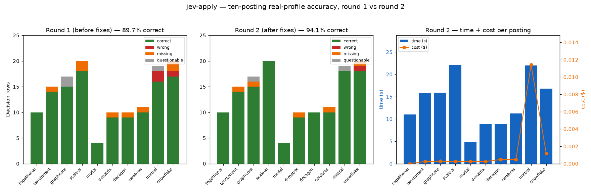

# jev-apply — ten-posting accuracy report, round 1 vs round 2

Source: two independent cold judgements of the same ten real postings against the real profile,
before and after a round of correctness fixes, joined against each round's own run index for
company/family/ATS. Same 10 postings, same 136 Decision rows, real profile, both rounds
`--no-submit`. No personal value appears below — only slugs, companies, counts, milliseconds, and
dollars.

`fill accuracy` is the judge's own `correct-among-filled / filled` figure carried over from each
round's totals (`fill`/`check` rows only, PLAN §2.6, drafts excluded) — a `questionable` fill still
counts toward the numerator since the runner wrote something defensible; a `missing` row is not in
the filled set at all by definition.

## Method

Ten fresh real postings (never seen by the fixes below), filled twice against the same real profile
with `node scripts/apply.mjs --url <posting> --no-submit --json` — once before the fixes described
in [`docs/POSTMORTEM.md`](../../docs/POSTMORTEM.md), once after them. No Submit control was ever
clicked. Each of the 64 screenshots per round (`full.png` + `viewport-*.png`) was judged cold, field
by field, against the posting's own answer key and the stored profile in
`~/.config/jev-apply/memory/*.yaml`, by an independent second pass with no access to the first
judgement's verdicts until after its own grading was frozen. Every accuracy number below is that
judge's tally, not a self-report from the runner.

## Per posting, round 1 → round 2

| # | company | family | ATS | fields | correct | wrong | missing | accuracy % | fill accuracy % | asks | time s | cost $ |
|---:|---|---|---|---:|---:|---:|---:|---:|---:|---:|---:|---:|
| 1 | together-ai | ml_engineer | greenhouse | 10 | 10 | 0 | 0 | 100.0 | 100.0 | 0 | 9.9→11.0 | $0.000000 |
| 2 | tenstorrent | ml_engineer | greenhouse | 15 | 14 | 0 | 1 | 93.3 | 100.0 | 2 | 15.9→15.8 | $0.000246 |
| 3 | graphcore | research_engineer | greenhouse | 17 | 15 | 0 | 0→1 | 88.2 | 100.0 | 4 | 14.3→15.9 | $0.000273 |
| 4 | scale-ai | research_scientist | greenhouse | 20 | 18→20 | 0 | 2→0 | 90.0→100.0 | 100.0 | 3→1 | 19.5→22.1 | $0.000241 |
| 5 | modal | research_engineer | ashby | 4 | 4 | 0 | 0 | 100.0 | 100.0 | 1 | 4.4→4.8 | $0.000242 |
| 6 | d-matrix | inference | ashby | 10 | 9 | 0 | 1 | 90.0 | 100.0 | 0 | 8.7→8.9 | $0.000248 |
| 7 | decagon | research_engineer | ashby | 10 | 9→10 | 0 | 1→0 | 90.0→100.0 | 100.0 | 3→2 | 7.5→8.8 | $0.000474 |
| 8 | cerebras | research_scientist | ashby | 11 | 10 | 0 | 1 | 90.9 | 100.0 | 1 | 11.1→11.2 | $0.000496 |
| 9 | mistral | applied_scientist | ashby | 19 | 16→18 | 2→0 | 0 | 84.2→94.7 | 86.7→92.9 | 2→3 | 20.6→22.0 | $0.006118→$0.011390 |
| 10 | snowflake | research_scientist | ashby | 20 | 17→18 | 1 | 2→1 | 85.0→90.0 | 92.9→93.3 | 5→4 | 15.1→16.8 | $0.001175 |
| | **totals (10)** | | | **136** | **122→128** | **3→1** | **8→5** | **89.7→94.1** | **97.1→98.1** | **21→18** | **126.9→137.3** | **$0.009513→$0.014785** |
| | **medians** | | | 13.0 | 12.0 | 0.0 | 1.0→0.5 | 90.0→94.0 | 100.0 | 2.0→1.5 | 12.7→13.5 | $0.000260 |

## What was wrong and what changed

Six rows moved between the two rounds, all improvements, closing three of the systematic errors
named in round 1 — every one is a fixed-in-tree entry in
[`docs/POSTMORTEM.md`](../../docs/POSTMORTEM.md):

- **Employment/education fact IDs the resolver read did not exist on the real profile** — the
  resolver looked up fixed ids (`f.employment.current`, `f.education.school`) that only the
  synthetic bench profile carries; a real profile's descriptive, dated ids never matched, so a
  required job title, employer, or school field came back empty on three boards even with the fact
  on file. Fixed by falling back to the newest `f.employment.*`/`f.education.*` row by `since:` —
  `docs/POSTMORTEM.md` **A17** `employment_education_id_miss`. 4 rows: `missing → correct`.
- **A required personal-fact question was classed as prose and handed to the writer** — "What
  spoken languages are you fluent in?" was a textarea with a question mark, so it was classed
  `essay` and drafted from a story that says nothing about languages, producing a self-defeating
  disclaimer in a required field. Fixed by classifying a fact-seeking textarea as a fact, never an
  essay, so it asks instead of drafts — `docs/POSTMORTEM.md` **A19** `fact_question_drafted`. 1 row:
  `wrong → correct`.
- **Canonical question matching dropped the topic qualifier in the label** — "What's your most
  complex project **with LLM**?" collapsed onto a topic-free saved narrative (a physics-inference
  story) instead of the four LLM-specific items on file. Fixed by refusing to collapse a
  topic-qualified label onto a topic-free answer unless the stored text itself carries the
  qualifier — `docs/POSTMORTEM.md` **A18** `topic_qualifier_dropped`. 1 row: `wrong → correct`.

Six findings from round 1 remain open as of round 2 and are tracked as guards **B4–B7, B10, B11** in
[`docs/POSTMORTEM.md`](../../docs/POSTMORTEM.md) §2 (third-party-employer inference, citizenship
blind to export-control rows, an unmapped country dropping a relocation preference, a Yes/No answer
forced onto a categorical select, an acknowledgement notice classed as a demographic decline, and a
misleading `why` on every work-authorization row) — none of them regressed a `correct` row to
non-`correct`, and round 2's own judge re-checked and held all 122 of round 1's `correct` verdicts.

## Reading the numbers

Accuracy rises from 89.7% to 94.1% (122 → 128 of 136 rows), and fill accuracy from 97.1% to 98.1%
(101/104 → 105/107) — the runner's dominant failure mode in both rounds is under-writing (a required
field left empty), not writing something false: `wrong` drops from 3 to 1 and `missing` from 8 to 5,
while the corpus produces at most one `wrong` row in either round after the fixes land. Two postings
move to 100% correctness that weren't there before (scale-ai 90.0→100.0%, decagon 90.0→100.0%);
snowflake's one remaining `wrong` row (a third-party-employer question answered from the application
pipeline, `docs/POSTMORTEM.md` **B4**) is the only genuinely incorrect fill left in the corpus, right
by luck rather than by design. Median time per posting rises slightly (12.7s → 13.5s) because the
round-2 writer call on mistral is longer (186 words vs. 20) and correctly grounded this time, which
is also why total cost rises ($0.0095 → $0.0148) even as correctness improves — the round-1 spend
was mostly wasted on a wrong answer, the round-2 spend buys a right one.
