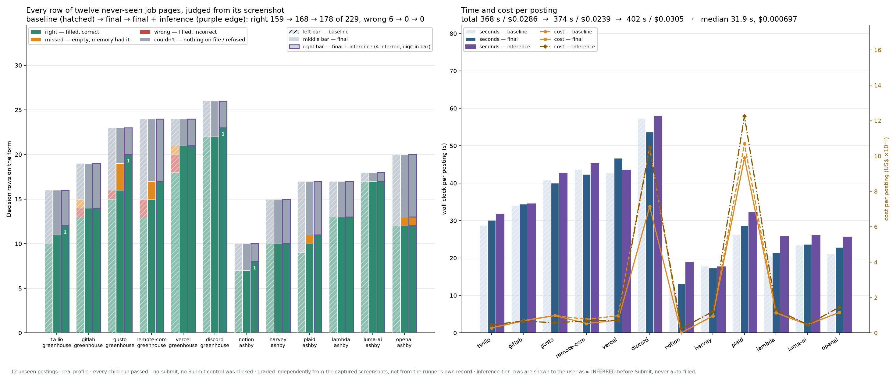

# Twelve never-seen job pages

## Method

Twelve real, currently-open job postings the runner had never touched — six hosted Greenhouse boards
and six Ashby boards, twelve different companies across nine role families. Each was filled end to end
by `scripts/apply.mjs` against a real user profile and a real Chrome session, exactly as a user would
run it. **No application was submitted:** the screenshot harness passes `--no-submit` to every child
run, so no Submit control was ever clicked, on any posting, in any round.

Every posting was then photographed — the whole form plus one viewport-width capture per scroll step,
100 images per round. An independent judge with no access to the run that produced the fills graded
**every Decision row from those screenshots**, against the user's own saved memory, using one fixed
vocabulary:

- **right** — the row is filled, and the value is correct for that question and that candidate.
- **wrong** — the row is filled, and the value is incorrect.
- **missed** — the row is empty, and the saved store answered it.
- **couldn't** — the row is empty because nothing was on file, or a policy gate correctly refused to
  sign something on the user's behalf, or the control could not take the answer.

The point of grading from photographs rather than from the runner's own log is that the two can
disagree, and when they do the form is what a recruiter sees. The same twelve postings were captured
three times — a **baseline** round, a **final** round after the defects the baseline exposed were
fixed, and a **final + inference** round adding the evidence tier described below. All three columns
are the same 229 rows on the same twelve pages.

## Results — final + inference

| # | company | family | ATS | rows | right | wrong | missed | couldn't | inferred | asks | s | $ |
|---|---|---|---|---|---|---|---|---|---|---|---|---|
| 1 | twilio | ml_engineer | greenhouse | 16 | 12 | 0 | 0 | 4 | 1 | 3 | 31.7 | 0.000445 |
| 2 | gitlab | backend | greenhouse | 19 | 14 | 0 | 0 | 5 | 0 | 3 | 34.5 | 0.000675 |
| 3 | gusto | ml_engineer | greenhouse | 23 | 20 | 0 | 0 | 3 | 1 | 1 | 42.7 | 0.000567 |
| 4 | remote-com | product_manager | greenhouse | 24 | 17 | 0 | 0 | 7 | 0 | 6 | 45.2 | 0.000677 |
| 5 | vercel | infra_sre | greenhouse | 24 | 21 | 0 | 0 | 3 | 0 | 2 | 43.5 | 0.000718 |
| 6 | discord | security | greenhouse | 26 | 23 | 0 | 0 | 3 | 1 | 1 | 57.9 | 0.010480 |
| 7 | notion | security | ashby | 10 | 8 | 0 | 0 | 2 | 1 | 2 | 18.8 | 0.000249 |
| 8 | harvey | backend | ashby | 15 | 10 | 0 | 0 | 5 | 0 | 4 | 17.7 | 0.001203 |
| 9 | plaid | data_engineer | ashby | 17 | 11 | 0 | 0 | 6 | 0 | 5 | 32.1 | 0.012251 |
| 10 | lambda | gpu_performance | ashby | 17 | 13 | 0 | 0 | 4 | 0 | 4 | 25.8 | 0.001306 |
| 11 | luma-ai | research_scientist | ashby | 18 | 17 | 0 | 0 | 1 | 0 | 0 | 26.0 | 0.000467 |
| 12 | openai | research_engineer | ashby | 20 | 12 | 0 | 1 | 7 | 0 | 7 | 25.6 | 0.001447 |
| | **totals** | | | **229** | **178** | **0** | **1** | **50** | **4** | **38** | **401.5** | **0.0305** |

**Still zero wrong values across 229 rows on twelve live employer forms.** Every one of the 178 values
the runner put on a page is correct — 100 % of filled rows, now across 19 more rows than the final
round. Of all rows, including the ones nothing on file could answer, 77.7 % are right, and exactly one
row remains that the saved store could have answered and did not.

Per posting: median **31.9 seconds**, median **$0.000698**, and **3 questions** back to the user.

## Three rounds

| | baseline | final | final + inference |
|---|---|---|---|
| rows | 229 | 229 | 229 |
| right | 159 (69.4 %) | 168 (73.4 %) | **178 (77.7 %)** |
| **wrong** | **6** | **0** | **0** |
| missed | 2 | 7 | **1** |
| couldn't | 62 | 54 | **50** |
| correct, of rows actually filled | 96.4 % | 100 % | **100 %** |
| questions back to the user | 50 | 48 | **38** |
| rows inferred from evidence | — | — | **4** |
| Jev requests | 27 | 27 | 41 |
| wall clock, all twelve | 367.9 s | 374.5 s | 401.5 s |
| spend, all twelve | $0.0286 | $0.0239 | $0.0305 |
| postings safe to submit unattended | 0 | 1 | 1 |

The six wrong rows the baseline produced were not cosmetic. Two were work-authorization answers that
came out the exact opposite of the truth, because the question scoped itself to where the *candidate*
lives and the runner answered for where the *employer* is. Two were demographic rows declined even
though the form offered an option stating the value the user had saved. One wrote a personal detail
into a row whose condition the user's own history never opened. One answered a data-processing consent
out of a standing "I decline to state my demographics", which is not a signature. All six closed in the
final round and stayed closed.

## What the third round adds

The **evidence tier** answers a class of row the earlier rounds kept losing: a question the runner
understood perfectly and had no key for, sitting beside memory that holds the *evidence* for the
answer without holding the answer itself. It reads the evidence, proposes only values the form itself
offers (or a value computed from the user's own dates), and then has to justify that exact answer
against the evidence text before anything is written. It never touches a demographic row, a question
about somebody else, an essay, a file, or any attestation beyond three standard notices the user
signed off in one sentence. Everything it does write is shown to the user under **► INFERRED**, with
its evidence cited, before Submit — it is never a silent fill.

Twenty rows entered the tier across the twelve postings. **Four** were answered; the other sixteen the
tier refused, and the refusals are the more interesting half:

- every in-office and office-location commitment was refused — a stated willingness to relocate does
  not settle whether this person will be in *that* office on *those* days, and the tier said so, twice
  at the top of its confidence scale;
- both interview-recording consents were refused at the justification step;
- both "how many years of experience" rows were refused, because what counts as production experience
  is a judgement this user never made.

All four answers that did reach a page are the same question — *how did you hear about us?* — answered
from the run's own provenance: the application was filled on the company's own hosted job board, so the
company's own careers listing is how it was found. Each picked the one option on that form that is
true, from lists where every alternative (LinkedIn, Indeed, Glassdoor, a referral, an ad) would have
been false. The independent judge graded all four **right**, with no row downgraded to
"defensible but check".

**The honest caveat on the +10 right.** Ten rows are newly filled against the final round, and only
**four** of them are the inference tier. The other six are ordinary deterministic fixes that landed
after the final round was photographed — a postal-code field that prints what non-US applicants should
enter, a location list whose catch-all is the only truthful pick, two prior-employment rows that name
several companies at once, a conditional text box whose label spells out the answer for the other
branch, and a US state-notice row whose second option is "I am not a resident". The two are separable
because the tier stamps its own rows, and they are separated in the table above and in
[`fresh-pages.json`](fresh-pages.json).

**And on the cost.** Spend rose $0.0066 against the final round. **$0.0010 of that is the inference
tier** — 14 extra model requests across twelve postings, about $0.00008 each. The remaining $0.0056 is
writer spend on the two postings that put a text-drafting call on the critical path; the writer is
non-deterministic and unrelated to this change.

The one row still in the `missed` column is a required location picker on a form whose own list offers
the candidate's city with one more level of the address spelled out than the saved value carries — the
same city the identical control accepted on five other postings in this round.

Raw per-posting numbers, including all three rounds and the deltas, are in
[`fresh-pages.json`](fresh-pages.json).
