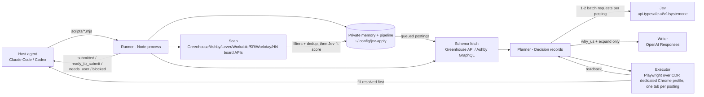

# jev-apply — Plan (v2)

Status: v2 plan. Evidence for the numbers below (API limits, latency, ATS form anatomy) was measured live
while planning and is summarized inline. This file is the decision record; when a measurement disagrees
with it, this file gets patched.

## 0. Decisions (fixed)

| # | Decision | Chosen | Why (evidence) |
|---|---|---|---|
| D1 | Form factor | Agent skill (Claude Code + Codex) with a **skill-owned Playwright runner** | Only form factor that keeps the fill loop in our process — no host turn per field |
| D2 | Decider | Jev (`jev-1.13.0`, pinned) for every *selection*: canonical-question-for-field, option-for-select, fit score, label clustering when building the bank | 255-option Choice verified live; 100 titled options → correct at 1.0; ~400 ms warm, batchable |
| D3 | Writer | OpenAI Responses API (GPT-5.x) for *new* text only; output is a per-application draft, never memory | Jev cannot write; drafts are not facts |
| D4 | First targets | Greenhouse, then Ashby | 41 Ashby / 30 Greenhouse in a 74-company AI-infra probe; both expose the form schema without auth |
| D5 | Discovery | **Pipeline**: 6–8 providers + tracked companies + cross-run dedup + statuses + queue→apply; batch apply plans all N first and asks once | user decision; a fixed provider contract and filter chain keep it model-free |
| D6 | Onboarding input | Résumé PDF(s) + links; an **eight-item** day-1 questionnaire; everything else asked lazily at first sight | user decision; a 19-prompt interview breaks "embarrassingly simple" |
| D7 | Repo | `theadaply/jev-apply`, public, MIT | user decision |
| D8 | Submit | `p.auto_submit` (per-user, overridable per company) gates the click: `true` + nothing left to ask → the runner clicks Submit, waits for the ATS's own confirmation, and returns `submitted`; `false`/absent (asked once at onboarding, defaults to unset until answered) → stops at `ready_to_submit` for the user to click | user decision; captcha/ToS risk becomes a per-user tradeoff set once, not a fixed rule |
| D9 | LinkedIn Easy Apply | Out of scope | LinkedIn ToS §8.2 forbids automation |
| D10 | EEO / demographic | Filled from `p.eeo` (gender, hispanic_latino, race, veteran_status, disability_status, pronouns?) whenever the preference is on file — never skipped; absent → asked once, then stored | user decision; a demographic control is a real form field, and leaving it blank still blocks a `required` submit |
| D11 | Private data | `~/.config/jev-apply/` (0700): `config.json`, `memory/`, `documents/`, `applications/`, `pipeline/`, `profile/` | skill dirs are symlinked/replaced on update |
| D12 | Browser lifecycle | Runner **spawns Chrome once** on `~/.config/jev-apply/profile` with `--remote-debugging-port`, connects with `chromium.connectOverCDP`, **disconnects on exit (never closes)** so the filled tab survives; `--answers`/`--resume` re-attach to the same tab | the filled tab must outlive the runner process; Chrome ≥136 allows CDP only on a non-default profile; profile accumulates history for captcha score |
| D13 | Fill before ask | Resolved fields are filled **before** the `needs_user` batch is returned; the half-filled form makes the questions self-explanatory | questions arriving on a blank form on application #1 read as an interrogation |
| D14 | Return contract | Four statuses: `submitted` · `ready_to_submit` · `needs_user` · `blocked{reason}`; one JSON object on stdout, exit 0 for all four | the host needs exactly one parse path |

Open (need the user): **O1** milestone-1 Greenhouse URL (hosted `job-boards.greenhouse.io` page, no
AI-usage attestation, no education/employment repeaters); **O2** primary host (default Claude Code).
O3 is closed by D12 (Playwright Extension attach is a post-demo spike, not a dependency).

## 1. What the user experiences

Five verbs, spoken to the host agent (SKILL.md routes them). Nothing shows probabilities, mapping tables,
or per-field approvals.

1. **"Learn my background"** → `scripts/learn.mjs --resume a.pdf [--resume b.pdf] --links …`. The host
   echoes **≤6 lines of prose** ("Jane Doe, ML/inference engineer, 3 roles, 2 degrees, 14 project bullets,
   LinkedIn/GitHub found") plus any contradictions, then asks the **eight day-1 questions** (§2.4) in one
   message. Answers are written to memory. Re-running with a changed résumé produces a diff, not a reset.
2. **"Complete this application <url>"** → `scripts/apply.mjs --url … --json`. The runner fills
   everything it can — including EEO/demographic rows from `p.eeo` and restrictive-agreements rows from
   `p.legal.restrictive_agreements` whenever those preferences are on file — **then** returns `needs_user`
   with only the questions the form asks about *you* (label → options → "I'll remember this for
   <scope>"). The host relays them in one message; the user answers; `--answers` fills the rest. If
   nothing else is left to ask and `p.auto_submit` resolves true (company override, else global), the
   runner clicks Submit itself, waits for the ATS's own confirmation, and returns `submitted`; otherwise
   it returns `ready_to_submit` with the 20-line summary (§2.6).
3. **"Use that answer next time" / corrections** → `scripts/remember.mjs` with an inferred scope
   (`global` / `company:<slug>` / `role_family:<name>`); asks only when scope is ambiguous. Summary lines
   carry handles (`d1`, `c2`) so "keep d1, but shorter" is a one-liner.
4. **"Find roles"** → `scripts/scan.mjs`: new postings enter the pipeline as `found` with a Jev fit
   score and a reason built from the user's own story titles.
5. **"Apply to the queue"** → `scripts/apply.mjs --queue 5`: plans all N (HTTP + Jev, no browser), fills
   every resolved field on all N tabs, returns **one** merged `needs_user`, then finishes each posting to
   `submitted` or `ready_to_submit` per its own `p.auto_submit`.

## 2. Architecture



### 2.1 Division of labour

| Concern | Owner | Never |
|---|---|---|
| Identity fields (name, email, phone, links, résumé file) | code from `facts` via ATS stable ids / `labelRules` | Jev, LLM |
| "Which canonical question is this field?" | Jev Choice over canonical ids (core + family + narrative + company template) + `none_of_these`; answer comes from `answers.yaml` | full answer text in criteria; stories in the hot path |
| "Which form option matches?" | Jev Choice over the form's options + `none_of_these`; multi-select = one Noul per option | a first-option (`options[0]`) fallback, any default value |
| Numbers, dates, years-since, notice period | code from `facts` (`since: YYYY-MM`, rules) | Jev (cannot count) |
| `why_us` text | user gives one sentence → writer expands with 1–2 matched stories | drafting from bullets alone |
| `company_specific` questions (need first-hand product experience) | user | writer |
| Optional textareas / cover letter with no curated answer | left blank, listed under NOT FILLED | speculative drafts |
| Setting values, uploads, verification | Playwright adapters, per-field isolation | asking the host per field |
| Questions about the user's circumstances | user, once per application (or once per queue) | guessing |
| EEO / demographic fields | code from `p.eeo`, matched against the live DOM (Greenhouse's schema does not describe the demographic block) via `canon/vocab/eeo-{gender,hispanic-latino,race,veteran,disability}.yaml` | Jev, LLM, inferring from name/photo/résumé — filled only when `p.eeo` is on file, `ask` once otherwise, never `skip` |
| Restrictive-agreements / "bound by other agreements" questions | code from `p.legal.restrictive_agreements` (global preference) | asking every time once the preference exists — asked once, then reused |
| Clicking Submit | code, gated on `p.auto_submit` (global, overridable per company), exactly one click | clicking with any `ask` row still open, clicking twice, or clicking without waiting for the ATS's own confirmation |

### 2.2 Runner pipeline (`scripts/apply.mjs`)

Everything before step 8 is HTTP + Jev; no browser is touched until the plan exists.

1. **Detect** ATS from URL. v1: hosted Greenhouse (`job-boards.greenhouse.io/<token>/jobs/<id>`)
   and Ashby (`jobs.ashbyhq.com/<org>/<uuid>/application`). Embedded `iframe#grnhse_iframe` boards and
   other ATSs → `blocked{reason:"unsupported_ats"}` in v1.
2. **Fetch schema** (no browser): Greenhouse `GET boards-api.greenhouse.io/v1/boards/{token}/jobs/{id}?questions=true`;
   Ashby `POST jobs.ashbyhq.com/api/non-user-graphql?op=ApiJobPosting` with the exact GraphQL document
   **captured from DevTools into `eval/fixtures/ashby-query.graphql` first** (`field` is a `JSON!`
   scalar — request it bare). Backup for Ashby: a 20-line label reader over the rendered DOM.
   `--record-schema` saves the raw response to `eval/fixtures/<ats>-<id>.json`; `--schema <file>` plans
   offline from it.
3. **Normalize → `FormPlan`** (§2.3): trim labels (Greenhouse API labels carry trailing spaces), parse
   char/word limits from label + help text, tag each question with `class` and `control`, resolve the
   `selector` per ATS, flag `sensitive` (EEO) and `policy_gate` (AI-usage / arbitration / consent
   attestation regex list in `src/schema/classes.mjs`). Restrictive-agreements-style questions keep the
   `circumstance`/`core` class they already carry — they resolve from a preference, not from `ask`.
4. **Resolve deterministically** into `Decision` records (§2.3): identity/links/résumé from `facts` +
   `preferences`; `sensitive` → `fill` from `p.eeo` when it is on file, else `ask` once (never `skip`);
   `policy_gate` → `ask` (stored company-scoped afterwards) — restrictive-agreements-class rows are the
   one exception: `fill` from `p.legal.restrictive_agreements` when it is on file, else `ask` once;
   `applied_before` → derived from `pipeline.yaml`; "how did you hear" → derived from pipeline
   provenance; numeric/date questions → computed from `since:` facts and rules; `why_us` → `ask` (one
   sentence) unless a `company` answer for this company exists; `company_specific` → `ask`.
5. **Jev request 1** (keep-alive client; `JEV_MODEL = "jev-1.13.0"`): one Choice per still-open question
   asking **"which canonical question is this field an instance of?"** (§2.7) over the candidate canon
   ids + `none_of_these`. Candidates per form = universal core (~45) + the posting's job family
   (~15–25) + narrative prompts (~12) + any recorded template for this company — always < 255. Criteria
   text = canonical question text + its most common surface forms. The chosen id resolves to a typed
   answer from `answers.yaml` (§2.4): `constant` → value; `rule` → evaluated with the job's country/
   city/posted range; `policy` → stored stance; `narrative` → curated text (length variant by the
   field's limit); `company` → generated at queue time; `never` → `ask`. A token estimator splits into
   parallel requests under ~56k. Only fields with no canonical match fall back to blob-title selection
   over `kind: story|answer`.
6. **Jev request 2** (select/radio/boolean/multi-select rows whose pick was not `none_of_these`):
   Choice over the form's own options + `none_of_these` with `state = {question, answer_text}`; multi-select
   → one Noul per option ("does `answer_text` support selecting `option`?"). Option labels are
   whitespace/case-normalised before any equality check (Ashby radios carry `value="on"`; pick by label).
7. **Gate** → `Decision.action`. Until M0-b's eval on the two real forms sets thresholds (no published
   threshold is evidence-based): `none_of_these` or `confidence < 0.5` → `ask` (or `draft` for
   `why_us`/essay classes per §2.1); runner-up gap `< 0.15` → `fill` + `check`; else `fill`. Thresholds
   live in `src/jev/gates.mjs`, nowhere else.
8. **Execute resolved rows** (D12, D13): connect over CDP to the dedicated profile (spawn Chrome if not
   running), open a tab per posting, and for every `fill` Decision the ATS adapter sets the control:
   Greenhouse `#<name>` / `#question_<id>`; react-select = focus → type → wait for `[role=option]` in
   `#react-portal-mount-point` → click → assert `.select__single-value` text and the hidden required
   input; `input#resume` via `setInputFiles` (Playwright library — no workspace-root restriction).
   Ashby `[class*="ashby-application-form-input"]` by `id === path`; radios via `label[for$="-radio-N"]`;
   `input#_systemfield_resume` via `setInputFiles`. Cadence 150–400 ms per field with real mouse moves.
   Every set is **read back** (value persisted, chip/option text present, file name shown) and logged to
   `trace.jsonl`. A failed set after 2 attempts becomes `action:"ask"` with a screenshot — the fill
   continues; `blocked` is reserved for no page / no schema / CDP lost.
8½. **Live-DOM EEO match**: Greenhouse's own schema fetch (step 2) does not describe the demographic
    block at all — it only exists once the page renders. `greenhouse.eeoControls(page)` reads the
    rendered controls; `matchLiveControls(live, {questions, decisions}) → {retry, novel}` pairs each
    one (`demographic_<id>` vs. the DOM's `<id>`, plus label) against the plan's `p.eeo`-sourced
    Decisions and fills them the same way as any other `fill` row — same read-back, same trace. Inert
    for Ashby/generic, whose schemas already carry the demographic questions.
9. **Ask once**: if any `ask` rows remain, snapshot-diff the page for conditional follow-ups that appeared
   after filling (delta re-plan, max 2 rounds), then return `needs_user{questions:[{qid,label,options,
   remember_as:{kind,scope}}]}` and **disconnect without closing**. `Decision`s are frozen to
   `applications/<slug>/decisions.json`. `--answers answers.json` re-attaches, stores answers as scoped
   `answers.yaml` entries (`source:user`, scoped), re-plans only the `ask` rows (idempotent), and executes them.
10. **Write** (OpenAI, `OPENAI_MODEL` constant) — at fill time only for `company` answers and unmatched essays: `expand` mode turns a matched bullet-length story into a
    200-word answer within the parsed limit; `why_us` mode takes the user's one sentence + the 1–2
    stories Jev ranked highest and writes the paragraph. Post-checks: every number/org name appears in
    the grounding set; **no other company's name from the pipeline appears** (substitution check).
    Drafts are `drafted[]`, never memory, until promoted with company scope (§2.4).
11. **Verify**: re-snapshot; every `required` control non-empty; no new required controls; write
    `applications/<slug>/{decisions.json, trace.jsonl}`. Stop rules: 2 set/readback attempts per field;
    3 consecutive no-change actions → `blocked`; Jev requests > 40 or wall time > 120 s per posting →
    `blocked{reason:"budget"}`. Never: reload or close the tab.
12. **Submit or report**: resolve `p.auto_submit` (company override, else global). `false`/absent →
    write `applications/<slug>/summary.md` (§2.6) and emit `ready_to_submit`. `true` → locate the Submit
    control (adapter `findSubmit`), click it **exactly once**, then `confirmSubmitted` polls for the
    ATS's own confirmation (URL change, a confirmation-page selector, or a "your application has been
    submitted" text match) up to a fixed timeout. Confirmed → `status:"submitted"`, the pipeline entry
    for this posting is set to `applied`, `summary.md` gets a SUBMITTED header with the confirmation
    text/URL/screenshot, emit `submitted`. Not confirmed → no second attempt — `blocked{reason:
    "submit_failed", screenshot}` with the tab left open so the user finishes by hand. Never: reload,
    close the tab, or click Submit a second time.

Queue mode (`--queue N`): steps 1–7 for all N in parallel, step 8 on all N tabs, one merged and
deduplicated `needs_user` ("visa sponsorship?" asked once, stored as a fact), then steps 9–12 per posting
sequentially; per-posting failures are isolated.

### 2.3 Data shapes (canonical)

```ts
type FormPlan = { ats:"greenhouse"|"ashby"; url:string; job:{title,company,description};
  questions: Array<{ qid:string; label:string; help?:string; required:boolean; section?:string;
    type:"text"|"textarea"|"file"|"single_select"|"multi_select"|"boolean"|"number"|"date"|"phone"|"url";
    control:"text"|"textarea"|"react_select"|"native_select"|"radio"|"checkbox"|"tel"|"file"|"date";
    selector:string; options?:Array<{label:string; value:string}>; limits?:{chars?:number; words?:number};
    class:"identity"|"circumstance"|"essay"|"why_us"|"company_specific"|"policy_gate"|"sensitive"|"optional_text";
  }> };

type Decision = { qid:string; label:string; source:"fact"|"preference"|"answer"|"story"|"option"|"derived"|"user"|"writer"|"none";
  value?:string; option?:string; canon?:string; confidence?:number; gap?:number;
  action:"fill"|"check"|"ask"|"draft"|"skip"; why:string;            // why is one short clause, shown in --dry-run
  readback?:{ok:boolean; observed:string; attempts:number} };

// answers.json (host → runner)
{ "<qid>": { "value":"No", "remember_as":{"kind":"fact","id":"f.work_auth.de.needs_sponsorship","scope":"global"} } }

// Jev request 1 (canonical question for field)
{"model":"jev-1.13.0",
 "state":{"job":{"title":"Senior Inference Engineer","company":"Acme"},
          "questions":{"q7":{"label":"Describe a project where you improved system performance.","type":"textarea","limits":{"words":200}}}},
 "questions":{"canon_q7":{"type":"choice",
   "instructions":"Which canonical question is `questions.q7` an instance of? Pick the one asking for the same information.",
   "criteria":{"q.narrative.proudest_project":"Describe a technical project you are proud of / your most significant work (also: 'tell us about a project', 'what have you built')",
               "q.narrative.hardest_problem":"Describe the hardest technical problem you solved (also: 'a technical challenge you overcame')",
               "none_of_these":"No saved item answers this"}}}}
```
Rules (from the official Jev skill guidance): ids are for code; one narrow judgment per question; questions
are isolated so each carries its own context; always a `none` exit; validate `choice ∈ criteria`,
probabilities sum ≈ 1, argmax == choice; positive one-hop phrasing.

### 2.4 Memory (private, `~/.config/jev-apply/memory/`, YAML per section, atomic writes)

- `facts[]` `{id, value, since?: "YYYY-MM", source: resume:<doc>#p<n> | user | link:<url> | pipeline, updated}` —
  never model-written. Work authorization is **two-valued per target country**:
  `{authorized_now, needs_sponsorship_future, status, expiry?}`. Skills carry `since:` so "years of X" is
  computed at fill time. Time-based facts older than 90 days are re-confirmed inside the next
  `needs_user` batch, never as a separate prompt.
- `preferences[]` `{id, value, overrides[{scope, value}], source}` — scope ∈ `global | company:<slug> |
  role_family:<name>`; resolution company > role_family > global. Includes `salary` (range + currency per
  role family + which end to state), `notice_rule`, `acceptable_locations[]` (drives relocation /
  in-office answers per city), `resume_by_role_family`, `looking_for` (target roles, must-haves,
  dealbreakers — also feeds §2.5 fit), `auto_submit` (boolean; company > global, like every other
  preference), `eeo` (`{gender, hispanic_latino, race, veteran_status, disability_status, pronouns?}`,
  canonical values from `canon/vocab`, each field independently `decline`-able), `legal.
  restrictive_agreements` and `legal.previously_employed` (`"Yes"`/`"No"`, user-stated only — never
  code-defaulted, exactly like any other preference; absent → `ask`). Shapes: `references/memory-
  format.md`.
- `documents[]` `{id, path, sha256, role_families[]}`; `learn.mjs` re-runs as a diff when a `sha256` changes.
- `answers[]` — the user's pre-computed answers keyed by canonical question id (§2.7):
  `{qid, kind: constant|rule|policy|narrative|company|never, value | rule_ref | variants{short,medium,
  long}, family?: <role_family>, scope, source: fact:<id> | user | authored:<model>@<date>, reviewed:
  bool, updated}`. `narrative` answers are LLM-authored at onboarding from facts + stories and shown to
  the user **once** for curation; `company` answers are produced per posting at queue time and reviewed
  in the queue's batch; `constant`/`rule`/`policy` are never shown for review.
- `stories[]` (raw material, formerly "blobs") `{id, title, text, tags[], source}` — résumé bullets,
  accepted drafts, interview answers; used to author narrative answers and as the fallback selector pool.
- `drafts[]` per application; `corrections[]` `{when, scope, rule, source}`.
- Promotion: a draft becomes a story or a curated answer only via `remember.mjs` ("keep d1"); `company`
  promotions are forced to `company:<slug>` scope and checked against existing answers with one Jev Noul ("same content?") to
  prevent duplicates. "Submitted without edit" does **not** promote.

**Day-1 questionnaire (exactly eight, asked once):** (1) work authorization per target country
(two-valued); (2) notice-period rule; (3) salary range + currency per role family and which end to state;
(4) preferred email/phone — only if the résumé shows more than one; (5) which résumé for which role family
— only if more than one PDF; (6) "what are you looking for" (target roles, must-haves, dealbreakers,
acceptable locations); (7) EEO self-identification (`p.eeo`: gender, hispanic/latino, race, veteran
status, disability status, pronouns), each field its own "decline to answer" option — reused, filled, on
every future form's demographic block instead of skipped; (8) auto-submit preference (`p.auto_submit`):
should the runner click Submit itself once nothing else needs asking, or always stop at ready-to-submit.
**Lazy at first sight, then remembered at the right scope:** relocation / in-office per city, security
clearance, references, arbitration/consent/AI-usage attestations (company scope, always asked —
`policy_gate` is never answered from memory), restrictive-agreements / non-compete attestations (one
global ask, stored as `p.legal.restrictive_agreements`, answered from memory on every form after),
`why_us` (one sentence per company). **Cut:** story prompts at onboarding (stories come from résumé
bullets and accepted drafts), "how did you hear" (derived).

### 2.5 Discovery & pipeline (`scripts/scan.mjs`, `scripts/pipeline.mjs`, D5)

**Sources** — `~/.config/jev-apply/companies.yml` (`name`, `provider`, `token/org/site`, `keywords`,
`enabled`) plus `boards:` feeds; a discover-ATS prober fills entries from bare company names. Every
provider implements one contract (`detect(url)` / `fetch(entry)` → `{title,url,company,location,
description,postedAt,salary?}`; zero auth; allowlisted hosts; `redirect:'error'`):

| Provider | Endpoint (public, no auth) | Notes |
|---|---|---|
| Greenhouse | `GET boards-api.greenhouse.io/v1/boards/{token}/jobs?content=true` | `?questions=true` per job for the planner |
| Ashby | `GET api.ashbyhq.com/posting-api/job-board/{org}?includeCompensation=true` | `applyUrl` = `/application` page; the schema endpoint (`non-user-graphql`) returns 429 above ~6 concurrent requests — serialize |
| Lever | `GET api.lever.co/v0/postings/{site}?mode=json` | apply later (visible hCaptcha) |
| Workable | `GET apply.workable.com/api/v3/accounts/{sub}/jobs` | rate-limited; posted-age filter |
| SmartRecruiters | `GET api.smartrecruiters.com/v1/companies/{co}/postings` | list only |
| Workday | `POST {tenant}.wd{n}.myworkdayjobs.com/wday/cxs/{tenant}/{site}/jobs` | list only |
| HN Who's Hiring | Algolia `search?tags=comment,story_{id}` on the monthly thread | parse `company \| role \| location` |

**Scan** — fixed filter order (blacklist → title keywords `word:`/`stem:` → seniority → location/remote
→ age → salary floor → content), dedupe by normalized URL (keep `gh_jid`; strip `utm_*`/`ref`/
`lever-source`) and `company::role`, cross-run dedup against `pipeline/scan-history.tsv`. No model calls.

**Fit** — one Jev request per ≤50 new postings: `score` (5 levels) per posting with
`state = {candidate: preferences.looking_for, jobs:{<id>:{title, location, description ≤2k}}}`, a `noul`
"does `jobs.<id>` require something in `candidate.dealbreakers`?", and a `choice` over `kind: story`
story titles → the reason line is the user's own material.

**Pipeline store** — `pipeline/pipeline.yaml`: `{id, url, company, title, provider, fit, reason, status,
found, updated, application, notes}`; `status ∈ found | queued | ready | applied | interview | offer |
rejected | withdrawn | expired`. `pipeline.mjs` = list / queue / mark / prune / render (`pipeline.md` is a
view). "Applied/interviewed before" answers derive from these statuses (one consent flag: treat unknown
as No). Corrections such as "never contract roles" become filter entries via `remember.mjs`.

### 2.6 `ready_to_submit` / `submitted` summary (≤20 lines, the only thing the user reads before or after Submit)

```
Acme — Senior Inference Engineer · https://job-boards.greenhouse.io/acme/jobs/123   ready to submit
Filled 20 of 21 · résumé: systems.pdf
► DRAFTED   d1 "Why Acme?" 190 words — from your sentence + latency-cut story
► CHECK     c1 "Years of distributed systems": 4 (since 2022-06)
► YOU ANSWERED  visa sponsorship: No (remembered globally) · relocate to Berlin: ask me each time (Acme only)
► POLICY    "AI Policy for Application": Yes — answered by you, Acme only
► EEO       4 rows filled from your saved p.eeo (values masked — sensitive rows are never printed)
► MONEY     salary: 180–200k USD, stated 190k (role family: inference)
► NOT FILLED  cover letter (optional, no matching story)
If Submit errors: run `apply.mjs --resume acme-123` — it lists every field with its intended value.
```
`submitted` swaps the header's last word for `submitted`, adds a `confirmed: "<ATS confirmation
text>" (<timestamp>)` clause to the `Filled` line, and appends `Pipeline: acme-123 → applied.`; every
other ► line is unchanged. Rules: no probabilities; every ► item has a handle `remember.mjs` accepts;
>2 ► items besides DRAFTED on application #2 onward is an M0-b failure metric. `blocked` prints the same
header plus `reason` and the screenshot path — a Submit click that got no confirmation is
`blocked{reason:"submit_failed"}`, never silently retried; captcha suspicion prints `label: value` lines
so the user can finish by hand.

### 2.7 Question bank (`canon/`) — pre-answer once, map at fill time

Measured on 127 real Greenhouse ML postings: 2,291 question instances collapse to **176 distinct
labels**; five appear on every form; the form is set by the **company's template**, not the job. So the
bank is layered, data-derived, and public (question text only — no personal data):

| Layer | Size | Examples | Answer kinds |
|---|---|---|---|
| Universal core | ~45 | name, email, phone, links, résumé, cover letter, address/location, start date, deadlines, relocation, in-office %, authorized-in-country, sponsorship now/future, arbitration, restrictive agreements, previously interviewed/applied/employed, how did you hear, privacy consent, AI-usage attestation, age ≥ 18, expected salary, pronouns | constant, rule, policy, never |
| Family screening | ~15–25 × 20 families | years of X, frameworks/languages, portfolio/publications/GitHub, degree level + field, seniority self-rating, clearance, product-area interests | constant, rule |
| Narrative | ~12 prompts (+ family variants) | why this role, why this company, proudest project, hardest problem, conflict, leadership, failure, "exceptional work", additional information, what you're looking for, cover letter | narrative, company |
| Company template | per company seen | the exact canonical-id list a company's form uses | derived |

Each canonical question: `{qid, text, layer, family?, type, answer_shape, kind_default, dependency?
(parent qid + condition), options_seen[] (observed vocabularies with aliases), surface_forms[] (real
labels + counts by ATS), frequency, jurisdiction_notes?}`. Families (20): backend, frontend, full-stack,
mobile, infra/SRE, security, systems/embedded/compilers, GPU/performance, ML engineer, ML/research
scientist, research engineer, applied scientist, data scientist, data engineer, analytics engineer,
AI product/forward-deployed, product manager, product designer, solutions/customer engineer, devrel/
technical writer.

Build: `scripts/canon-scan.mjs` collects ≥20 postings per family from Greenhouse (`?questions=true`),
Ashby (GraphQL, serialized) and Lever (apply-page HTML `cards`) into `corpus/` → `scripts/canon-cluster.mjs`
normalizes labels, dedupes exactly, then asks Jev per unresolved label "which canonical question is this
an instance of, or `new_question`?" against the growing canon (state = label, type, options, section);
additions are reviewed in batches before merging. Hold out 20% of postings for the coverage eval:
% of form questions mapped to a canonical question that has an answer — targets core ≥ 95%,
screening ≥ 85%, narrative ≥ 80%.

Onboarding after the eight questions: the user picks families → `scripts/answers.mjs` fills `answers.yaml`
for core + those families: constants and rules silently; narrative drafts (≤150 words, three length
variants) shown once for curation; a coverage line ("answers ready for 96% of questions seen in 400 real
forms; 12 narratives to review"). Queue time adds `company` answers for the selected postings, with the
user's one sentence per company requested in the queue's single `needs_user` batch.

## 3. Repo layout (`theadaply/jev-apply`)

```
SKILL.md                 six-field frontmatter (name: jev-apply); five verbs → which script, which flags
README.md · LICENSE (MIT) · INSTALL.md (agent-facing) · package.json (node ≥ 20)
scripts/
  install.mjs            creates ~/.config/jev-apply (0700) + config.json {envFile, profile}; fail-fast message naming TYPESAFE_API_KEY / OPENAI_API_KEY + signup URLs
  learn.mjs              résumé/links → memory YAML + ≤6-line echo + gaps (eight items max); diff mode on sha256 change
  apply.mjs              --url | --tab | --queue N · --answers f · --resume slug · --dry-run · --schema f · --record-schema · --json
  remember.mjs           corrections / promotions (d1, c1 handles) / new facts with scope
  scan.mjs               discovery → pipeline (found + fit score)
  pipeline.mjs           list | queue <ids> | mark <id> <status> | prune | render
  jev-smoke.mjs          3-option choice smoke test; prints latency
src/
  config.mjs             constants JEV_MODEL="jev-1.13.0", OPENAI_MODEL; envFile loader (10 lines)
  memory/                store.mjs (YAML, atomic), schema.mjs, resolve.mjs (scope), derive.mjs (since:, notice rule, applied_before)
  jev/                   client.mjs (keep-alive, retries, validation, split on max_tokens_exceeded), plan.mjs (request 1/2), gates.mjs
  writer/                openai.mjs (expand, why_us; grounding + substitution post-checks)
  schema/                greenhouse.mjs, ashby.mjs, classes.mjs (class/policy_gate regexes, limits parser), normalize.mjs → FormPlan
  browser/               chrome.mjs (spawn/connectOverCDP/disconnect), adapters/{greenhouse,ashby}.mjs, readback.mjs, trace.mjs
  discover/              providers/{greenhouse,ashby,lever,workable,smartrecruiters,workday,hn}.mjs, detect.mjs, filters.mjs, dedupe.mjs, fit.mjs
  pipeline/              store.mjs (pipeline.yaml + scan-history.tsv), status.mjs, render.mjs
references/              jev-usage.md (condensed Jev usage + official skill rules), ats-greenhouse.md, ats-ashby.md, memory-format.md
canon/                   questions.yaml (canonical bank), families/<family>.yaml, vocab/*.yaml (option aliases), templates/<company>.yaml
corpus/                  recorded public schemas by ATS/family (question text only); holdout.txt
scripts/canon-scan.mjs · scripts/canon-cluster.mjs · scripts/canon-eval.mjs · scripts/answers.mjs
eval/fixtures/           ashby-query.graphql, <ats>-<id>.json recorded schemas, synthetic memory
eval/plan.test.mjs       offline: fixture + memory → expected Decision table; threshold calibration report
docs/PLAN.md · docs/CHANGELOG.md
```
Dependencies: `@typesafe-ai/sdk`, `playwright` (library only), `openai`, `yaml`, `pdf-parse`. Node ≥ 20.
No framework, no build step. Deferred (post-demo, same repo): DOM-snapshot fallback (`schema/dom.mjs`,
adapters/generic), embedded-iframe Greenhouse, repeaters, `--watch-submit`, Playwright-Extension attach,
`select.mjs` smart-paste helper.

## 4. Build order (one session; offline first, browser last, pipeline after the two demos)

Each step ends with an observable check. Phases A–B are the demo-critical path; Phase C delivers D5;
Phase D publishes.

**Phase Q — question bank (runs in parallel with Phase A; ML families first)**
- Q1 (45 min) `canon-scan.mjs` on the tracked companies: ≥20 postings for each of the two ML families
  from the schemas already recorded, then the other 18 families across Greenhouse/Ashby/Lever →
  `corpus/` with ≥400 postings; `holdout.txt` = 20%.
- Q2 (60 min) `canon-cluster.mjs` → `canon/questions.yaml`: universal core + per-family sets; every
  canonical question carries `surface_forms`, `options_seen`, `kind_default`; review pass on additions.
- Q3 (30 min) `canon-eval.mjs` on the hold-out → coverage per layer/ATS/family printed; core ≥ 95%.
- Q4 (45 min) `answers.mjs` on the real memory for the two ML families → `answers.yaml`; narrative
  drafts presented for one curation pass; coverage line printed.

**Phase A — offline core (~3 h, no browser)**
- A1 (30 min) scaffold, `config.mjs`, `jev/client.mjs`, `scripts/jev-smoke.mjs` → prints a valid 3-option
  choice with latency ≈ 400–1000 ms; 256-option request returns the split path, not a crash.
- A2 (45 min) `schema/greenhouse.mjs`, `schema/ashby.mjs` (GraphQL doc captured from DevTools →
  fixture), `normalize.mjs`, `classes.mjs`, `--record-schema` → `apply.mjs --url <O1> --dry-run` prints
  21 questions, one `class` + `control` + `selector` each, matching a human read; Ashby prints 13.
- A3 (30 min) `learn.mjs` on the real résumé + `memory/store.mjs` + `derive.mjs` → ≤6-line echo, gaps
  list ≤ 8 items containing "what are you looking for" and no story prompts; YAML written.
- A4 (40 min) `jev/plan.mjs` (request 1 + 2, kind pre-filter, estimator split) + `gates.mjs` + Decision
  table → `--dry-run --schema fixtures/gh.json` shows identity rows `source:fact`, EEO `fill` from
  `p.eeo` (or `ask` once on a fixture with none), attestation `ask`, Yes/No rows carrying `option`, ≤ 3
  `ask` rows; `trace.jsonl` holds exactly 2 Jev requests.
- A5 (30 min) `writer/openai.mjs` (`expand`, `why_us`, post-checks) → dry-run shows `d1` for the
  `why_us` row given a one-sentence answer file; substitution check rejects a draft containing another
  pipeline company's name.
- **M0-b** runs here: both fixtures × the real memory → confidence/gap distribution → thresholds set.

**Phase B — browser, two real applications (~2 h)**
- B1 (30 min) `browser/chrome.mjs` (spawn profile with `--remote-debugging-port`, `connectOverCDP`,
  disconnect) + `readback.mjs` → open the O1 posting, `fill` first name, disconnect; the tab is still
  open with the value; a second process re-attaches and reads it back.
- B2 (45 min) `adapters/greenhouse.mjs` (text, react-select with wrong-value test → never option 0,
  phone, `setInputFiles` from `~/.config/jev-apply/documents/`) → `apply.mjs --url <O1>`: resolved fields
  filled, `needs_user` with ≤ 3 questions; `--answers` → `ready_to_submit` + summary; **user submits (M1)**.
- B3 (45 min) `adapters/ashby.mjs` (text, radio by label, `_systemfield_resume` upload → chip visible,
  upload op sequence in trace) → second real application to `ready_to_submit` (**M2**), then one
  company-scoped and one global `remember.mjs` correction; re-run O1 dry-run shows the scoped one absent.

**Phase C — pipeline + queue (~1.5 h)**
- C1 (45 min) providers (Greenhouse, Ashby, Lever, Workable, HN first; SmartRecruiters/Workday if time),
  filters, dedup, `pipeline/store.mjs`, `scan.mjs` → ≥10 tracked companies scanned, `pipeline.yaml`
  populated, re-scan adds 0 duplicates.
- C2 (30 min) `fit.mjs` + `pipeline.mjs` → top 10 by score with story-title reasons; `queue 3`.
- C3 (30 min) `--queue 3` → resolved fields filled on 3 tabs, **one** merged `needs_user`, 3 ×
  `ready_to_submit` (**M3**).

**Phase D — eval + publish (~45 min)**: `eval/plan.test.mjs` on the recorded fixtures; README (five
verbs, 20-second GIF), INSTALL.md, SKILL.md; push (**M4**).

Success measure (the product bar): applications reaching `ready_to_submit` with zero corrected values;
secondary: `needs_user` count per application (≤ 3 on #1, ≤ 1 from #3 on), canon coverage on the
hold-out (core ≥ 95%), wall time, Jev requests per application (≤ 4), cost per application (< $0.01).

## 5. Risks (ranked) and mitigations

1. **Score-based reCAPTCHA rejects the scripted session invisibly** (Greenhouse Enterprise invisible,
   Ashby v3/Enterprise) — dedicated profile that accumulates history, headed, real mouse moves,
   150–400 ms cadence; the user clicks Submit unless `p.auto_submit` is on, in which case the runner
   clicks it itself exactly once and a missing confirmation becomes `blocked{reason:"submit_failed"}`,
   never a silent retry (D8); on error the summary's `--resume` line lists every value so the user
   finishes by hand. Post-demo: Playwright-Extension attach to the daily profile.
2. **Target form forbids AI-created answers** (some AI-lab careers forms carry such an attestation) —
   `policy_gate` detection; `why_us` is always the user's sentence expanded, never invented; attestations
   answered by the user, company-scoped, every time — except restrictive-agreements-class questions,
   answered from the global `p.legal.restrictive_agreements` preference once it exists. O1 is chosen
   without one.
3. **Gate thresholds unvalidated** — M0-b in Phase A on 34 real fields; one file; pinned model.
4. **Application #1 is mostly questions** (7/21 fields fillable from a résumé alone) — eight-item
   questionnaire + derived answers + fill-before-ask (D13) so the questions arrive on a half-filled form;
   ≤ 3 asks on #1.
5. **Fan-out token cap** — kind pre-filter + estimator split (A1 check).
6. **React-select commit semantics** — portal-option click + hidden-required assert; wrong-value
   test in B2; never option 0.
7. **Filled tab dies when the runner exits** — D12: spawn once, connect over CDP, disconnect never close;
   B1 proves re-attach.
8. **Wrong canonical match at high confidence on near-duplicate questions** — surface-form-rich criteria text, `check` on small runner-up gap, hold-out coverage eval, M0-b eval.
9. **Ashby GraphQL document drift** — captured into a fixture; DOM label-reader backup.
10. **Network latency** (~1 s cold, ~0.4 s warm) — one keep-alive client; ≤ 2 requests per posting;
    queue mode plans all N in parallel.
11. **Writer sameness / substitution errors** — grounding + other-company-name post-checks; DRAFTED
    always visible; the user-edited version is what gets promoted.
12. **Vendor drift** — pin `jev-1.13.0`; SDK 429 backoff; budget stop rule; OpenAI outage degrades to
    "paste your draft".
13. **Scope leakage / answer drift after 30 applications** — company-forced scope for `company` answers,
    same-content Noul at promotion, 90-day re-confirm for time-based facts, no `last_used` bookkeeping.
14. **EEO react-selects render no options, blocking a posting before any application question is reached**
    — observed live: three Greenhouse demographic react-selects returned `no_options_rendered` in a row
    and the no-progress stop rule fired before one application question was seen. Mitigation:
    `src/browser/controls.mjs`'s react-select flow gets a dedicated open-and-retry path for EEO comboboxes
    (explicit menu-open wait, portal-option read) before falling to `set_failed`, and the no-progress
    counter treats the EEO block as its own run so three EEO misses don't `blocked` the rest of the form.
15. **Auto-submit clicks the wrong control, or clicks twice** — `findSubmit`/`confirmSubmitted` are
    read-back gated like every other write; `submitReady` requires zero `ask` rows and zero required-
    empty controls before a click is attempted; the click happens exactly once per application; an
    unconfirmed submit is `blocked{reason:"submit_failed"}`, never retried; `p.auto_submit` defaults to
    unset until the user answers the day-1 question.

## 6. Explicitly not in v1

Own extension or side panel; OS-level smart-paste gesture (later: Raycast/Hammerspoon hotkey →
`scripts/select.mjs`, same engine); Workday / SmartRecruiters / iCIMS / Gem apply adapters;
embedded-iframe Greenhouse boards; LinkedIn; dashboards or per-field approval UI;

`variants` beyond short/medium/long on narrative answers.
